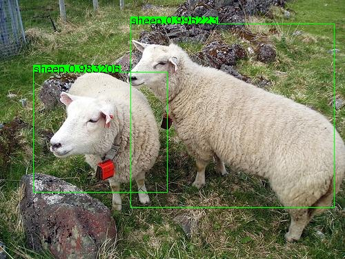

# caffe-yolov2-windows

## Reference

> https://github.com/eric612/Vehicle-Detection

> https://github.com/eric612/MobileNet-SSD-windows

> https://github.com/gklz1982/caffe-yolov2

> https://github.com/duangenquan/YoloV2NCS

## Modifications

1. caffe training 
2. add pre-trained model
3. fix bugs
4. windows support
5. vehicle detection

### Configuring and Building Caffe 

```
> cd $caffe_root/script
> build_win.cmd
```

## Usage

### convert model

`cd examples`

1. convert yolo.cfg to yolo.prototxt
2. convert yolo weights to caffemodel

### Detection

`cd caffe_root`
1. Download pre-trained [caffmodel](https://drive.google.com/open?id=1WXD6Pi47ryGPiTEtGeN4eDQsplgo35qm) , save at location $caffe_root/models/yolo/
2. examples\yolo_detection.cmd

If load success , you can see the image window like this 



### Trainning

There has two ways for training your dataset

1. training with caffe (recommand)
2. training with darknet project and convert the weights to caffemodel

### training with caffe


#### Prepare data option 1(recommand)

Save [lmdb](https://drive.google.com/open?id=15VB2qthaf0s9aYxCSWt8xE2BDvaZPsth) at location $caffe_root\data\yolo\

#### Prepare data option 2

Put your dataset into $caffe_root\data\yolo\VOCdevkit

```
> cd $caffe_root\data\yolo
> python get_list.py 
```

Check files label_map.txt,trainval.txt,test_2007.txt are all correct 

```
> cd $caffe_root\data\yolo
> create_dataset.cmd
```

#### Run training

```
> cd $caffe_root
> examples\yolo_train.cmd
```

### Training with darknet project

[yolo-windows](https://github.com/unsky/yolo-for-windows-v2)

[yolo-windows-my-version](https://github.com/eric612/yolov2-windows)

### Note

1. There has no data augmentation code inside (ex.hue,rotation) , note the training mAp was bad 
2. I still try to train a good caffemodel , currently ,the  deploy model was just show how to do training 

### Future

1. Add MobileNet-YOLO
2. Data augmentation  