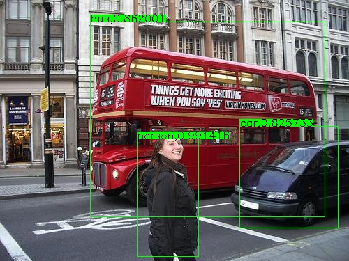
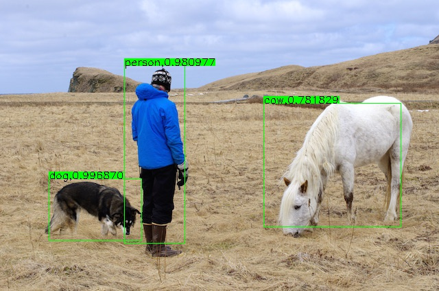

# caffe-yolov2-windows

## Linux Version

[MobileNet-YOLO](https://github.com/eric612/MobileNet-YOLO)

A caffe implementation of MobileNet-YOLO (YOLOv2 base) detection network, with pretrained weights on VOC0712 and mAP=0.718

Network|mAP|Download|Download|NetScope
:---:|:---:|:---:|:---:|:---:
MobileNet-YOLO-Lite|0.675|[train](models/MobileNet/mobilenet_iter_73000.caffemodel)|[deploy](https://github.com/eric612/MobileNet-YOLO/blob/master/models/yolov2/mobilenet_yolo_lite_deploy_iter_62000.caffemodel)|[graph](http://ethereon.github.io/netscope/#/gist/11229dc092ef68d3b37f37ce4d9cdec8)
MobileNet-YOLO|0.709|[train](models/MobileNet/mobilenet_iter_73000.caffemodel)|[deploy](https://github.com/eric612/MobileNet-YOLO/blob/master/models/yolov2/mobilenet_yolo_deploy_iter_80000.caffemodel)|[graph](http://ethereon.github.io/netscope/#/gist/52f298d84f8fa4ebb2bb94767fa6ca88)

Linux version fixed some bugs from this project . If I have time and machine(?) , I will update this project later , please be patient

## Reference

> https://github.com/eric612/Vehicle-Detection

> https://github.com/eric612/MobileNet-SSD-windows

> https://github.com/gklz1982/caffe-yolov2

> https://github.com/duangenquan/YoloV2NCS

## Modifications

1. caffe training 
2. add pre-trained model
3. fix bugs
4. windows support
5. vehicle detection

### Configuring and Building Caffe 

#### Requirements

 - Visual Studio 2013 or 2015
 - [CMake](https://cmake.org/) 3.4 or higher (Visual Studio and [Ninja](https://ninja-build.org/) generators are supported)
 - Anaconda 

The build step was the same as [MobileNet-SSD-windows](https://github.com/eric612/MobileNet-SSD-windows)
 
```
> cd $caffe_root/script
> build_win.cmd 
```
### Darknet YOLOv2 Demo

[graph](http://ethereon.github.io/netscope/#/gist/c062fa088c0f4cc58649dc560df27875)

Download [weights](https://drive.google.com/file/d/17w7oZBbTHPI5TMuD9DKQzkPhSVDaTlC9/view?usp=sharing) and save at $caffe_root/models/yolov2/

```
> cd $caffe_root/
> examples\demo_yolo_darknet.cmd
```



### MobilenetYOLO_V2 Demo

```
> cd $caffe_root/
> examples\demo_yolo.cmd
```

[](https://www.youtube.com/watch?v=8DelOtsyn4M)




### Trainning Prepare

Download [lmdb](https://drive.google.com/open?id=19pBP1NwomDvm43xxgDaRuj_X4KubwuCZ)

Unzip into $caffe_root/ 

Please check the path exist "$caffe_root\examples\VOC0712\VOC0712_trainval_lmdb"


### Training Darknet YOLOv2 

```
> cd $caffe_root/
> examples\train_yolo_darknet.cmd
```


### Trainning MobilenetYOLO_V2
  
```
> cd $caffe_root/
> examples\train_yolo.cmd
```


### Vehicle deploy model 

#### CLASS NAME

```
char* CLASSES2[6] = { "__background__","bicycle", "car", "motorbike", "person","cones" };
```
### Demo Video MobilenetYOLO_V2

```
> cd $caffe_root/
> examples\demo_yolo_custom.cmd
```

[](https://www.youtube.com/watch?v=JuCfOI9DrQ4)

### Future work 

1. yolov3 and upsameple layer

2. customize yolov2 and tiny yolov2